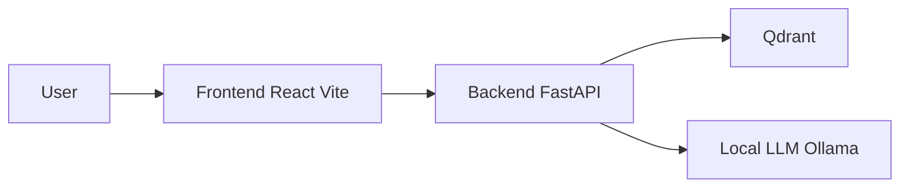

# Tathqeeb AI (تثقيب) – Shariah Compliance Verification

AI-powered verification of Islamic contracts against Shariah regulations. Tathqeeb (تثقيب) means "Verification" and "Authentication" in Arabic. Part of the Nitroo Al-Fiqh Hackathon; ensures your contracts comply with Islamic Shariah principles using an AI verification system.

## Features

- **Frontend**: Upload PDF contracts, run compliance checks, view detailed reports, history, analytics, and manage Shariah regulations. Built with React, Vite, and Tailwind CSS; PWA-ready.
- **Backend**: PDF text extraction, sentence-transformers embeddings, Qdrant vector store, and an LLM-based compliance agent (Ollama) for violation detection, severity levels, compliance scoring, and categorization.
- **Sample documents**: See [docs/islamic-contract-sample/](docs/islamic-contract-sample/) for a sample Islamic contract PDF.

## Architecture



## Prerequisites

- **Node.js** and **npm** (for frontend)
- **Docker** and **Docker Compose** (for backend and Qdrant)
- **Local LLM**: [Ollama](https://ollama.ai/) (or compatible API) running on port **11434**

## Project Structure

```
Task 2 Tathqeeb/
├── backend/          # FastAPI service, Qdrant, embeddings, compliance agent
├── frontend/         # React + Vite + Tailwind UI
├── docs/             # Sample Islamic contract PDFs
├── qdrant/           # Qdrant vector DB data (generated)
├── backend-fastapi-tunnel.bat
├── frontend-ai-tunnel.bat
└── qdrant-tunnel.bat
```

For backend module layout and API details, see [backend/README.md](backend/README.md).

## Quick Start

### Backend (Docker)

1. Go to the backend directory and copy environment variables:
   ```bash
   cd backend
   cp .env.example .env
   ```
2. Edit `.env` if needed (e.g. if Ollama runs on your host, set `LLM_API_URL=http://host.docker.internal:11434/api/chat` on Windows/Mac so the API container can reach it).
3. Start services:
   ```bash
   docker-compose up -d
   ```

### Frontend

1. Install dependencies and run the dev server:
   ```bash
   cd frontend
   npm install
   npm run dev
   ```
2. Open the URL shown by Vite (typically http://localhost:5173).

### URLs

| Service   | URL                      |
|----------|---------------------------|
| Frontend | http://localhost:5173     |
| API      | http://localhost:8000     |
| API docs | http://localhost:8000/docs |
| Qdrant   | http://localhost:6333     |

## Environment and Configuration

### Backend

Key environment variables (see [backend/.env.example](backend/.env.example) and [backend/README.md](backend/README.md)):

- `QDRANT_HOST`, `QDRANT_PORT` – Qdrant connection
- `QDRANT_CONTRACTS_COLLECTION`, `QDRANT_REGULATIONS_COLLECTION` – Collection names
- `EMBEDDING_MODEL`, `EMBEDDING_DIMENSION` – Sentence transformer model
- `LLM_API_URL`, `LLM_MODEL_NAME` – Local LLM endpoint and model

### Frontend

The frontend API client is configured to use `http://localhost:8000` as the backend base URL (see `frontend/src/api/client.js`). Change this if your API runs elsewhere.

## Tunnel Scripts (Optional)

For exposing local services (e.g. for demos) via [Cloudflare Tunnel](https://developers.cloudflare.com/cloudflare-one/connections/connect-apps/) (cloudflared):

| Script                    | Exposes              |
|---------------------------|----------------------|
| `backend-fastapi-tunnel.bat` | http://localhost:8000  |
| `frontend-ai-tunnel.bat`     | http://localhost:3000  |
| `qdrant-tunnel.bat`          | http://localhost:6333  |

**Note**: `frontend-ai-tunnel.bat` uses port 3000. To match it, run the frontend with a fixed port, e.g. `npm run dev -- --port 3000`, or use `npm run preview -- --port 3000` for production build.

## API and Further Reading

The API supports:

- Uploading PDF contracts
- Checking compliance against Shariah regulations
- Retrieving detailed compliance reports
- Managing regulations (add, list, search)

For full endpoint list, request/response examples, and local development (e.g. `uvicorn app.main:app --reload`), see [backend/README.md](backend/README.md).

## Demo

For the hackathon demo video, see the main repository [README](../README.md).
